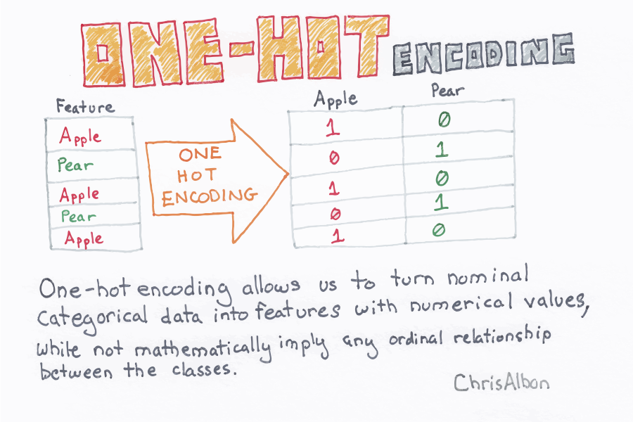

```{r setup, include=FALSE}
# Load all your packages here:
library(tidyverse)
library(GGally)
library(rpart)

# Set default behavior for all code chunks here:
knitr::opts_chunk$set(
  echo = TRUE, warning = FALSE, message = FALSE,
  fig.width = 16/2, fig.height = 9/2
)

# Set seed value of random number generator here. This is in order to get
# "replicable" randomness, so that any results based on random sampling or
# resampling are replicable everytime you knit this file. Why use a seed value
# of 76? For no other reason than 76 is one of my favorite numbers:
# https://www.youtube.com/watch?v=xjJ7FheCkCU
set.seed(76)
```

You will be fitting CART models to the data from the [Ghouls, Goblins, and Ghosts... Boo!](https://www.kaggle.com/c/ghouls-goblins-and-ghosts-boo/){target="_blank"} Kaggle competition. The competition's score for leaderboard purposes is the "Categorization Accuracy". However you will **NOT** be making any submissions to Kaggle.


***


# Load data

Read in data provided by Kaggle for this competition. They are organized in the `data/` folder of this RStudio project:

```{r}
training <- read_csv("data/train.csv")
test <- read_csv("data/test.csv")
sample_submission <- read_csv("data/sample_submission.csv")
```


## Look at your data!

Always, ALWAYS, **ALWAYS** start by looking at your raw data. This gives you visual sense of what information you have to help build your predictive models. To get a full description of each variable, read the data dictionary in the `data_description.txt` file in the `data/` folder.

Note that the following code chunk has `eval = FALSE` meaning "don't evaluate this chunk with knitting" because `.Rmd` files won't knit if they include a `View()`:

```{r, eval = FALSE}
View(training)
glimpse(training)

View(test)
glimpse(test)
```

In particular, pay close attention to the variables and variable types in the
`sample_submission.csv`. Your submission must match this exactly.


***


# Minimally viable product

Perform the following exploratory data analyses:

## Univariate explorations

**Categorical predictor**: Create a visualization of the categorical predictor variable `color`.

```{r}
ggplot(data = training, 
       aes(x = color)) +
  geom_bar() + 
  ggtitle("Count of Monsters by Color")
```


```{r}
ggplot(data = training, 
       aes(x = color, fill = as.factor(type))) +
  geom_bar() + 
  ggtitle("Count monsters by Color and Type") +
  labs(fill = "Monster Type")
```

**Outcome variable**: Create a visualization of the categorical predictor variable `type`.

```{r}
ggplot(data = training, 
       aes(x = type)) +
  geom_bar() + 
  ggtitle ("Counts of Monsters by type")
```


## Mutlivariate explorations

**Numerical predictors**: Create a visualization of the relationship of all four numerical predictor variables at once (`bone_length`, `rotting_flesh`, `hair_length`, `has_soul`) using the `ggpairs()` function from the `GGally` [package](http://ggobi.github.io/ggally/#ggallyggpairs). 

```{r}
ggpairs(training, columns = c("bone_length", "rotting_flesh", "hair_length", "has_soul"))
```

**Relationship of categorical predictor and outcome variable**: Create a visualization of the relationship between the categorical outcome variable `type` and any predictor variable of your choosing.


```{r}
ggplot(data = training, 
       aes(x = type, y = hair_length)) +
  geom_boxplot() +
  ggtitle("Type of Monster and Hair Length")


```


***


# Due diligence

1. Fit a CART where:
    * You use only the numerical predictors.
    * The maximum depth of the tree is 5.
    * You use the default "complexity parameter" 
1. Plot the tree.
1. Make predictions `type_hat` on the `training` data. Hint compare the output of `predict(model_CART, type = "prob")` and `predict(model_CART, type = "class")`.
1. Compute the "classification accuracy".

```{r, fig.height = 9, fig.width=16}
model_1_formula <- as.formula(type~bone_length + rotting_flesh + hair_length + has_soul)
tree_parameter <- rpart.control(maxdepth = 5)
model_1_CART <- rpart(model_1_formula, data = training, control = tree_parameter)

plot(model_1_CART)
text(model_1_CART, use.n = TRUE)
title("Predicting monster type with bone length, rotting flesh, hair length and soul")
box()
```

```{r}
predict_train <- model_1_CART %>%
  predict(type = "class", newdata = training) %>%
  enframe()

training <- training %>%
  mutate(type_hat = predict_train$value)
```

```{r}
accuracy = sum(training$type == training$type_hat) / nrow(training)
accuracy
```


***


# Reaching for the stars

Note that the $\alpha$ complexity parameter is the `cp` argument to `rpart.control()`.

1. Reusing the MP1 solutions code, for the range of `alpha` complexity parameters in the `alpha_df` data frame, return an estimate of the accuracy/error that Kaggle would return.
1. Plot the relationship between the alpha complexity parameter and accuracy.
1. Using the optimal $\alpha^*$ complexity parameter, write a `submission.csv` suitable for submission to Kaggle.

```{r}
alpha_df <- tibble(
  alpha = seq(from = 0, to = 0.05, length = 100),
  accuracy = 0
)

#5 Fold Cross Validation
training <- training %>%
  sample_frac(1) %>%
  mutate(fold = rep(1:5, length=n())) %>%
  arrange(fold)

for (i in 1:nrow(alpha_df)){
  
  alpha <- alpha_df$alpha[i]
  ALPHA <- rep(0,5)
  
  for(j in 1:5){
    pretend_training <- training %>%
      filter(fold != j)
    pretend_test <- training %>%
      filter (fold == j)
    
    #Fitting the Model + Training Model
    tree_parameter <- rpart.control(maxdepth = 5, cp = alpha)
    model_1_CART <- rpart(model_1_formula, data = pretend_training, control = tree_parameter)
    
    #Prediction based on model
    predict_pretend_test <- model_1_CART %>%
    predict(type = "class", newdata = pretend_test) %>%
    enframe()
    
    pretend_test <- pretend_test %>%
      mutate(type_hat = predict_pretend_test$value)
    
    accuracy = sum(pretend_test$type == pretend_test$type_hat) / nrow(pretend_test)
    
    ALPHA[j] <- accuracy
  
  }
  
  alpha_df$accuracy[i] <- mean(ALPHA)
  
}
```


```{r}
#Plotting the relationship between alpha complexity parameter and accuracy
ggplot(alpha_df, aes(x = alpha, y = accuracy)) + 
  geom_line()+
  labs(title = "Relationship between the alpha complexity parameter and accuracy")

```


```{r}
#Which alpha value yields highest accuracy
best_alpha_df <- alpha_df[which.max(alpha_df$accuracy),]
best_alpha = best_alpha_df$alpha
```

```{r}
model_2_formula <- as.formula(type~bone_length + rotting_flesh + hair_length + has_soul)
tree_parameter <- rpart.control(maxdepth = 5, cp = best_alpha)
model_2_CART <- rpart(model_1_formula, data = training, control = tree_parameter)
```

```{r}
 #Prediction based on model
 predict_test <- model_2_CART %>%
  predict(type = "class", newdata = test) %>%
    enframe()
    
test <- test %>%
  mutate(type = predict_test$value)
```

```{r}
submission <- test %>%
  select(id, type)

write.csv(submission, file = "data/submission")
```


***


# Point of diminishing returns

* Use one-hot-enconding to fit a predictive CART model using the categorical variable `color` and plot the tree. Set the maximum depth of the tree to 5 and use the default "complexity parameter".
* No need to generate an estimate of the accuracy that Kaggle would return. 



```{r}
library(onehot)
training2 <- onehot(training, stringsAsFactors = TRUE)

training <- training %>%
  mutate(value = 1)  %>%
  spread(color, value,  fill = 0 ) 

model_3_formula <- as.formula(type ~ black + blood + blue + clear + green + white)    
tree_parameter <- rpart.control(maxdepth = 5)

model_3_CART <- rpart(model_3_formula, data = training, control = tree_parameter)

plot(model_3_CART)
text(model_3_CART, use.n = TRUE)
title("Predicting monster type with color")
box()
```


